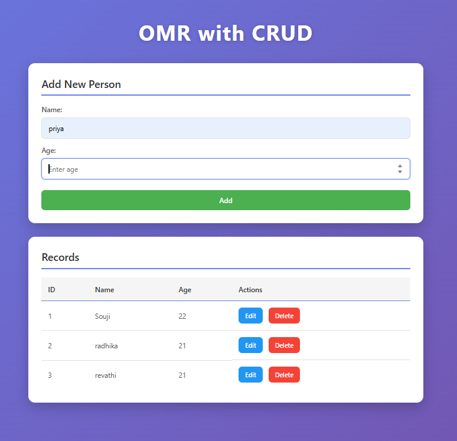

# Flask ORM CRUD Web Application

<p align="center">
  
</p>

A complete CRUD (Create, Read, Update, Delete) web application built with Flask, SQLAlchemy ORM, and SQLite.

## Project Structure

```text
CRUD/
├── app.py
├── data.db (auto-created)
├── requirements.txt
├── README.md
├── templates/
│   └── index.html
├── static/
│   └── style.css
```

## Features

* **Create**: Add new persons with name and age
* **Read**: View all records in a responsive table
* **Update**: Edit existing records
* **Delete**: Remove records from the database
* **Responsive Design**: Works on desktop, tablet, and mobile devices
* **Modern UI**: Gradient background, card-based layout, smooth animations
* **Automatic Database**: SQLite database created on first run

## Installation

### 1. Navigate to the Project Directory

```bash
cd "CRUD operations"
```

### 2. Install Required Dependencies

```bash
pip install -r requirements.txt
```

## Running the Application

### 1. Run the Flask Application

```bash
python app.py
```

### 2. Open Your Browser and Navigate To

```text
http://127.0.0.1:5000
```

## Database

The application uses SQLite with Flask-SQLAlchemy ORM. The database is automatically created on first run with a `Person` table containing:

* **id**: Primary key (auto-increment)
* **name**: String field for person's name
* **age**: Integer field for person's age

## Available Routes

* `GET /` - Display all records
* `POST /add` - Add a new record
* `POST /update/<id>` - Update a record
* `GET /delete/<id>` - Delete a record

## User Interface

### Main Page

* Input fields for Name and Age
* Add button to insert records
* Records table displaying ID, Name and Age
* Edit button to modify records
* Delete button to remove records
* Responsive and attractive design

## Styling

* **Color Scheme**: Purple gradient background with white cards
* **Layout**: Center-aligned responsive container
* **Effects**: Smooth animations, hover effects and box shadows
* **Buttons**

  * Green (#4caf50) for Add
  * Blue (#2196f3) for Update
  * Red (#f44336) for Delete

## Browser Support

Works on all modern browsers:

* Chrome/Chromium
* Firefox
* Safari
* Edge

## Requirements

* Python 3.7+
* Flask 2.3+
* Flask-SQLAlchemy 3.0+
* SQLAlchemy 2.0+

## Notes

* The database file `data.db` is created automatically in the project root.
* Data remains stored even after restarting the application.
* Age input is restricted to values between 1 and 150.
* The application runs in debug mode for development.

## License

This project is open source and available for educational purposes.

## Author

Lakshmi Sowjanya
